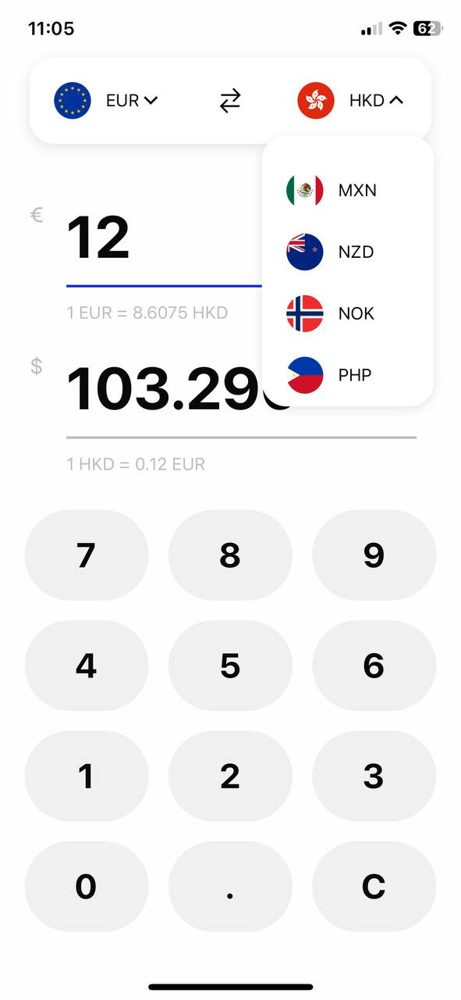
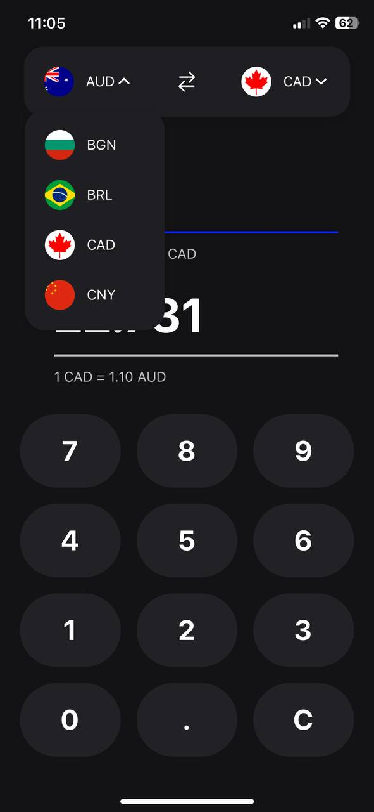
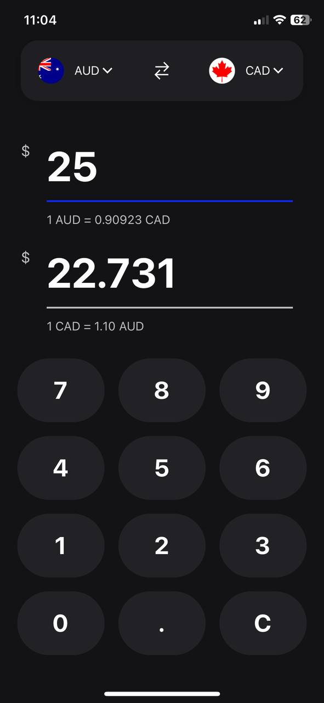

# Exchange rates app

## Made with:

-   React Native
-   Expo
-   Typescript
-   Async Storage
-   Redux toolkit

## How to run?

-   npx expo install / npm install / yarn
-   npx expo start / npm start / yarn start

## Design inspiration [Currency converter by Paulina Majkowska](https://dribbble.com/shots/21272410-Currency-Converter)

